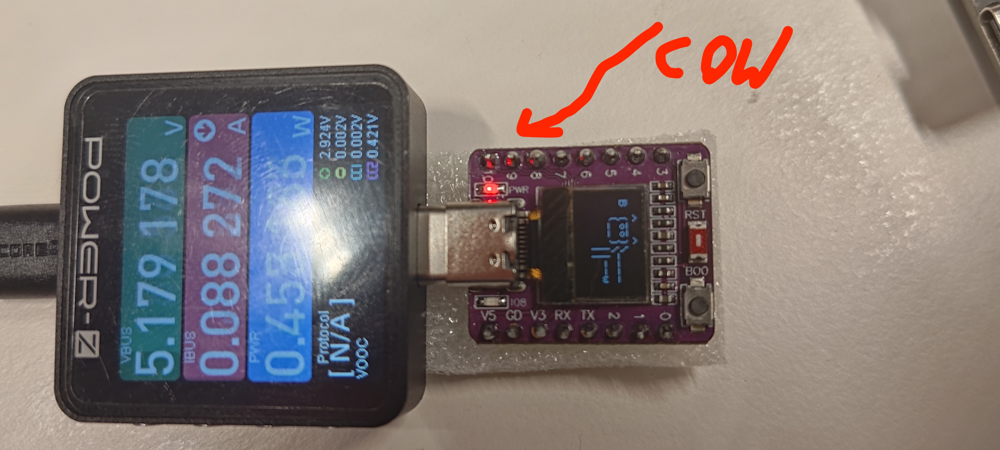

# COA-GATT-bleps for ESP32-C3/C6 with OLED

This project is for the ESP32-C3 and ESP32-C6 microcontrollers with an SSD1306 OLED display. It uses Rust and the Embassy async runtime.


# Power draft 
## ESP32C3
Power draft is 0.32W baseline to 0.52W with the BLE transmission in debug mode
and 0.45W with release mode

## ESP32C6
Power draft is 0.37W and 0.38W with the BLE transmission in debug mode

< BLE >
 -----
        \   ^__^
         \  (oo)\_______
            (__)\       )\/\
                ||----w |
                ||     ||

## Build

### Default Build (ESP32-C3)

```
cargo run-c3
```

### Build for ESP32-C6

```
cargo run-c6
```

### Switching Target Configuration

The project now supports both ESP32-C3 and ESP32-C6 targets through Cargo features with automatic runner selection.

To switch between targets, simply select the appropriate Cargo feature:
   - ESP32-C3 (default): `--features esp32c3` or omit the feature flag
   - ESP32-C6: `--no-default-features --features esp32c6`

The `.cargo/config.toml` file is configured to automatically select the appropriate runner based on the feature flag.

## Flash

### For ESP32-C3

```
just run-c3
# or 
cargo run
# or with explicit feature
cargo run --features esp32c3
```

### For ESP32-C6

```
just run-c6
# or with feature flag
cargo run --no-default-features --features esp32c6
```

### Release Builds with Flashing

For production use, you can build in release mode, flash the firmware, and run it:

```
just release-c3  # For ESP32-C3
just release-c6  # For ESP32-C6
```

These commands will:
1. Build the firmware in release mode (optimized for size and performance)
2. Flash the firmware to the device's non-volatile memory
3. Run the firmware

Note: The appropriate runner will be automatically selected based on the feature flag you use.

## Monitor Serial Output

### Debug Builds

#### For ESP32-C3

```
just monitor-c3
# or 
probe-rs attach --chip esp32c3 --probe <PROBE_ID> target/riscv32imc-unknown-none-elf/debug/coa_gatt_bleps_c3
```

#### For ESP32-C6

```
just monitor-c6
# or 
probe-rs attach --chip esp32c6 --probe <PROBE_ID> target/riscv32imc-unknown-none-elf/debug/coa_gatt_bleps_c3
```

### Release Builds

For monitoring release builds with proper defmt log formatting:

#### For ESP32-C3

```
just monitor-release-c3
# or simply
just monitor-release
```

#### For ESP32-C6

```
just monitor-release-c6
```

These commands will run the release build and pipe the output through `defmt-print` to properly format the defmt log messages.

### Probe Information

You can get your probe ID by running:

```
just list-probes
# or
probe-rs list
```

## Notes
- Targets: ESP32-C3, ESP32-C6
- Display: SSD1306 OLED (I2C)
- Async: Embassy

## TODO 
- [ ] test with sdl2 https://crates.io/crates/embedded-graphics-simulator
